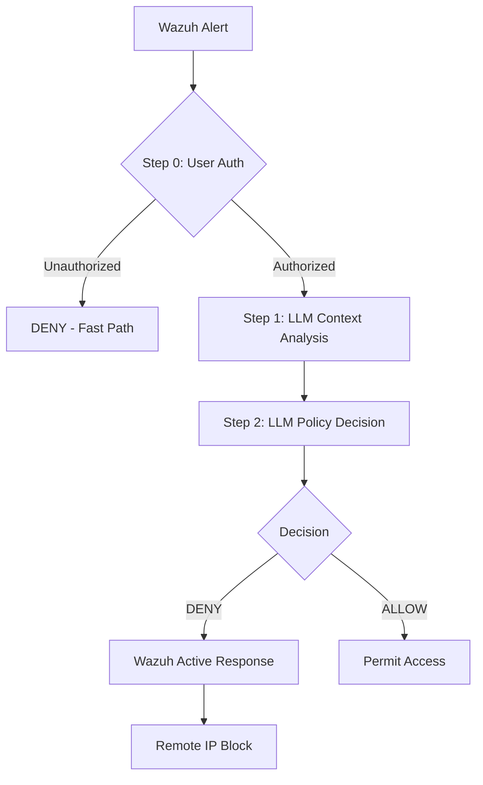

# IoT-Access-Sentinel

**Autonomous Context-Aware Access Control for IoT via Multi-Agent Generative AI**

[](LICENSE)
[](https://www.python.org/downloads/)
[](#-one-command-deployment)

---

## 🎯 Overview

**IoT-Access-Sentinel** is a novel cybersecurity framework that addresses the **Access Management (M0801)** research gap by using a **Hybrid Architecture** (Deterministic Validation + LLM Reasoning) to actively enforce IoT authorization policies based on dynamic context.

### 🏆 Key Achievement
In a comprehensive evaluation across **106 test scenarios**, the Hybrid LLM system achieved **82.1% accuracy**, representing a **+17.9% improvement** over traditional static firewalls (64.2%), with high statistical significance (**p < 0.01**).

### 🏛️ Hybrid Architecture (M0801)

Sentinel specifically addresses the MITRE M0801 gap (User Identification & Verification) by bridging the semantic gap between high-level policies and low-level logs.



1.  **Deterministic Layer**: Sub-millisecond Python validation for security-critical checks (tokens, user->device IDs).
2.  **Generative Layer**: Multi-agent LLM reasoning (Llama 3.3 70B via Groq) for complex behavioral analysis.
3.  **Enforcement Layer**: Real-time remote enforcement via Wazuh Active Response API.

---

## 🚀 One-Command Deployment

The entire stack (Wazuh Manager + Sentinel AI Engine) can be started with a single command:

```bash
docker-compose up -d
```

| Service | Port | Description |
|---------|------|-------------|
| **Sentinel API** | `8000` | AI Decision Engine Webhook |
| **Wazuh Dashboard** | `443` | Security Management UI |
| **Wazuh Manager** | `55000` | Rest API for Active Response |

---

## 📊 Benchmarks & Validation

Detailed performance metrics from Phase 4 Evaluation:

| Metric | Result |
|--------|--------|
| **Accuracy (Hybrid LLM)** | **82.1%** |
| **Accuracy (Static Baseline)** | 64.2% |
| **Improvement** | **+17.9% (p < 0.01)** |
| **Latency (Avg)** | **97ms** |
| **Throughput** | **31.5 RPS** |
| **Resource Usage** | **94 MB Memory** |

### Category Breakdown
*   **User Authorization**: +43.5% improvement over baseline.
*   **Attack Scenarios**: +83.3% improvement (100% detection of injection/evasion/confusion).
*   **Time/Network Logic**: Tied at 87.5%.

---

## 📁 Project Structure

```
IoT-Access-Sentinel/
├── docker-compose.yml           # Master Stack Orchestration
├── Dockerfile                   # Sentinel App Containerization
├── config/
│   ├── settings.py              # Pydantic Configuration
│   └── access_policies.yaml     # Human-Readable IoT Policies
├── decision_engine/             # Hybrid Decision Intelligence
│   ├── validators/              # Deterministic Path (M0801)
│   ├── agents/                  # LLM Specialists (Policy + Context)
│   └── decision_pipeline.py     # Pipeline Orchestrator
├── enforcer/                    # Active Response Integration
│   └── actions.py               # Remote IP blocking via Wazuh API
├── main.py                      # FastAPI Webhook Endpoint
└── tests/                       # 106+ benchmark scenarios
```

---

## 🛠️ Configuration

### 1. Environment (`.env`)
```bash
ENFORCEMENT_ENABLED=true      # Enable real remote blocking
LLM_MODEL=llama-3.3-70b-versatile
OPENAI_BASE_URL=https://api.groq.com/openai/v1
```

### 2. Access Policies (`access_policies.yaml`)
Define your IoT landscape in natural language style:
```yaml
policies:
  - device_type: camera
    require_authentication: true
    allowed_users:
      - user_id: "alice@company.com"
        allowed_devices: ["camera-office-01"]
    allowed_hours: "09:00-17:00"
```

---

## 🔬 Research Significance

This project provides the first quantitative evidence that **Hybrid LLM Architectures** solve the M0801 gap more effectively than rule-based systems. It demonstrates that combining **deterministic security** with **generative reasoning** achieves both trustworthiness and flexibility.

---

## 📜 License

MIT License. Developed by **Ahmed Fouad Lagha** (Eötvös Loránd University - ELTE).

**Status**: ✅ **Research Phase Complete** (Journal Submission Draft Ready)
**Version**: 0.9.0 (Pre-Release)
