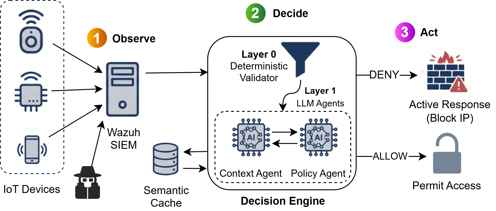
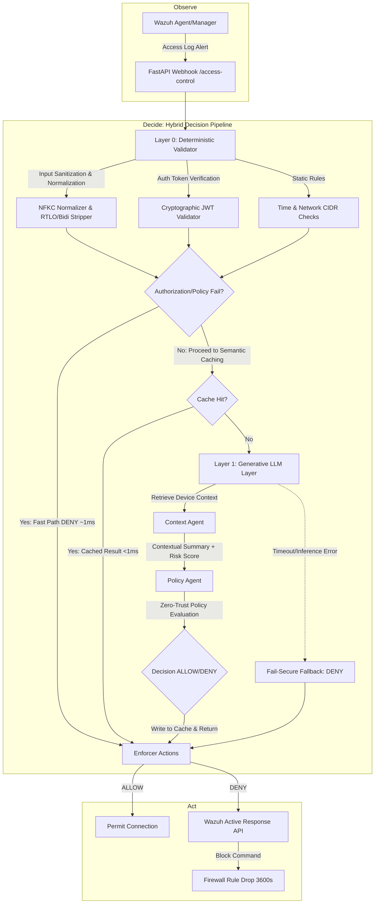

# IoT-Access-Sentinel

<div align="center">

**Autonomous Context-Aware Access Control for IoT via Multi-Agent Generative AI**

[](file:///home/lagha/PhD/projects/IoT-Access-Sentinel/LICENSE)
[](https://www.python.org/downloads/)
[](#-quick-start--deployment)
[](file:///home/lagha/PhD/projects/IoT-Access-Sentinel/manuscript/main_ceur.tex)

</div>

---

The framework specifically addresses the MITRE ATT&CK **Access Management (M0801)** gap (User Identification & Verification) by bridging the semantic gap between high-level policies and low-level logs. It places a deterministic validation pre-filter and multi-agent Large Language Model (LLM) reasoning in a unified real-time runtime authorization path.



_Figure 1: Architecture of the IoT-Access-Sentinel framework_

## Workflow

Sentinel enforces zero-trust authorization policies using a hybrid design that operates under an **Observe → Decide → Act** pipeline:



### 1. Layer 0: Deterministic Validation (Fast Path)
* **Input Sanitization**: Normalizes inputs using `unicodedata.normalize('NFKC')` and strips directional overrides (`\u202A`–`\u202E`), Bidi isolates (`\u2066`–`\u2069`), and zero-width spaces to protect against Unicode homoglyph and right-to-left override evasion attacks. Implemented in [validation.py](file:///home/lagha/PhD/projects/IoT-Access-Sentinel/common/validation.py).
* **Token Validation**: Cryptographically verifies JWT signatures, checks expiration, and validates that the token subject matches the identity requesting access. Implemented in [user_auth_validator.py](file:///home/lagha/PhD/projects/IoT-Access-Sentinel/decision_engine/validators/user_auth_validator.py).
* **Rule Engine**: Evaluates standard static constraints (IP network CIDR allowlists and day/time schedules) in Python. If credentials are missing, expired, or mismatch the ACL, the request is immediately blocked (Fast-Path DENY in **~1ms**).

### 2. Layer 1: Multi-Agent Generative Reasoning (Slow Path)
If deterministic checks pass but semantic ambiguity remains (e.g., unusual but auth-valid camera requests), the request moves to Layer 1 (**~150ms**):
* **Context Agent**: Aggregates metadata to build a structured context report and risk assessment. Implemented in [context_agent.py](file:///home/lagha/PhD/projects/IoT-Access-Sentinel/decision_engine/agents/context_agent.py).
* **Policy Agent**: Benchmarks the Context Agent's summary against the natural-language style policy using Zero-Trust reasoning and generates a structured decision (ALLOW/DENY) along with a **Verbalized Semantic Confidence** score. Implemented in [policy_agent.py](file:///home/lagha/PhD/projects/IoT-Access-Sentinel/decision_engine/agents/policy_agent.py).
* **Semantic Caching**: SHA-256 hashes of serialized context keys map requests to cached decisions (TTL: 1 hour), allowing repeated semantic queries to bypass the LLM and execute in sub-millisecond times. Managed in [decision_pipeline.py](file:///home/lagha/PhD/projects/IoT-Access-Sentinel/decision_engine/decision_pipeline.py).
* **Fail-Secure Default**: If the LLM client encounters rate limits, API outages, or latency exceeding the timeout budget (150ms), the system defaults to a fail-secure **DENY** status to prioritize security over availability.

### 3. Enforcement Layer
When a connection is denied, the system triggers the **Enforcer** (implemented in [actions.py](file:///home/lagha/PhD/projects/IoT-Access-Sentinel/enforcer/actions.py)). Sentinel submits a command via the Wazuh REST API to invoke a local firewall drop (`firewall-drop`) on the corresponding device's Wazuh agent, blocking the source IP dynamically (default duration: 1 hour).

## Project Structure

* [main.py](file:///home/lagha/PhD/projects/IoT-Access-Sentinel/main.py) — FastAPI server & Webhook handler
* [Dockerfile](file:///home/lagha/PhD/projects/IoT-Access-Sentinel/Dockerfile) — Production container builder
* [docker-compose.yml](file:///home/lagha/PhD/projects/IoT-Access-Sentinel/docker-compose.yml) — Wazuh + Sentinel local service orchestration
* [requirements.txt](file:///home/lagha/PhD/projects/IoT-Access-Sentinel/requirements.txt) — Python environment dependencies
* [common/](file:///home/lagha/PhD/projects/IoT-Access-Sentinel/common/) — Shared cross-cutting modules
  * [validation.py](file:///home/lagha/PhD/projects/IoT-Access-Sentinel/common/validation.py) — Layer 0 Unicode normalization & regex sanitization
  * [metrics.py](file:///home/lagha/PhD/projects/IoT-Access-Sentinel/common/metrics.py) — Prometheus metric registration & collection
  * [rate_limit.py](file:///home/lagha/PhD/projects/IoT-Access-Sentinel/common/rate_limit.py) — Sliding window API rate limiter
  * [tracer.py](file:///home/lagha/PhD/projects/IoT-Access-Sentinel/common/tracer.py) — Trace recording & activity history
* [config/](file:///home/lagha/PhD/projects/IoT-Access-Sentinel/config/) — Configuration definitions
  * [settings.py](file:///home/lagha/PhD/projects/IoT-Access-Sentinel/config/settings.py) — Pydantic Settings integration for environment variables
  * [access_policies.yaml](file:///home/lagha/PhD/projects/IoT-Access-Sentinel/config/access_policies.yaml) — Natural-language-style security policy declarations
* [decision_engine/](file:///home/lagha/PhD/projects/IoT-Access-Sentinel/decision_engine/) — Deciding core
  * [decision_pipeline.py](file:///home/lagha/PhD/projects/IoT-Access-Sentinel/decision_engine/decision_pipeline.py) — Hybrid orchestrator (Fast Path vs LLM routing)
  * [llm_client.py](file:///home/lagha/PhD/projects/IoT-Access-Sentinel/decision_engine/llm_client.py) — Thread-safe LLM client interface (Groq/Gemini/OpenAI)
  * [agents/](file:///home/lagha/PhD/projects/IoT-Access-Sentinel/decision_engine/agents/) — Multi-agent LLM wrappers
    * [context_agent.py](file:///home/lagha/PhD/projects/IoT-Access-Sentinel/decision_engine/agents/context_agent.py) — Situation reporter Agent
    * [policy_agent.py](file:///home/lagha/PhD/projects/IoT-Access-Sentinel/decision_engine/agents/policy_agent.py) — Access Policy assessor Agent
  * [validators/](file:///home/lagha/PhD/projects/IoT-Access-Sentinel/decision_engine/validators/)
    * [user_auth_validator.py](file:///home/lagha/PhD/projects/IoT-Access-Sentinel/decision_engine/validators/user_auth_validator.py) — Deterministic User-Device ACL & JWT validator
* [enforcer/](file:///home/lagha/PhD/projects/IoT-Access-Sentinel/enforcer/) — Action executors
  * [actions.py](file:///home/lagha/PhD/projects/IoT-Access-Sentinel/enforcer/actions.py) — Wazuh Active Response API client
  * [iptables_blocker.py](file:///home/lagha/PhD/projects/IoT-Access-Sentinel/enforcer/iptables_blocker.py) — Local host-level firewall drop wrapper
* [observer/](file:///home/lagha/PhD/projects/IoT-Access-Sentinel/observer/) — SIEM monitoring and connectors
  * [wazuh_connector.py](file:///home/lagha/PhD/projects/IoT-Access-Sentinel/observer/wazuh_connector.py) — REST client for Wazuh Manager configuration
  * [models.py](file:///home/lagha/PhD/projects/IoT-Access-Sentinel/observer/models.py) — Pydantic models for incoming Wazuh alerts
* [evaluation/](file:///home/lagha/PhD/projects/IoT-Access-Sentinel/evaluation/) — Test suites and benchmarks
  * [run_tests.sh](file:///home/lagha/PhD/projects/IoT-Access-Sentinel/evaluation/run_tests.sh) — E2E test suite bash runner

## Quick Start & Deployment

Deploy the entire stack (Wazuh Manager, Indexer, Dashboard, and the Sentinel API Engine) with a single command.

### 1. Environment Configuration
Create a `.env` file in the root directory (based on [.env.example](file:///home/lagha/PhD/projects/IoT-Access-Sentinel/.env.example)):

```bash
# Wazuh Credentials
WAZUH_USERNAME=admin
WAZUH_PASSWORD=ChangeMe-SecurePassword123!
WAZUH_INDEXER_PASSWORD=ChangeMe-SecurePassword123!
WAZUH_DASHBOARD_PASSWORD=ChangeMe-DashboardPassword456!

# LLM Selection (Groq-based Llama 3.1 8B Instant)
LLM_PROVIDER=openai
LLM_MODEL=llama-3.1-8b-instant
OPENAI_API_KEY=your-groq-api-key-here
OPENAI_BASE_URL=https://api.groq.com/openai/v1

# Security Tokens
JWT_SECRET_KEY=use-a-strong-random-jwt-key
WEBHOOK_API_KEY=use-a-strong-random-webhook-api-key

# Policy settings
POLICY_FILE_PATH=config/access_policies.yaml
ENFORCEMENT_ENABLED=true
```

### 2. Startup
Run docker-compose to build and spin up the environment:

```bash
docker-compose up -d --build
```

### 3. Exposed Services
Once deployed, the services are available on the following ports:

| Service | Port | Endpoint / Interface | Description |
|---------|------|----------------------|-------------|
| **Sentinel API** | `8000` | `http://localhost:8000/docs` | Interactive Swagger UI API documentation |
| **Wazuh Dashboard** | `80` (or `443`) | `https://localhost` | Security configuration and logs dashboard |
| **Wazuh Manager REST API** | `55000` | `https://localhost:55000` | Wazuh REST API endpoint for Active Response |
| **Prometheus Metrics** | `8000` | `http://localhost:8000/metrics` | Real-time system performance exporter |

## Evaluation & Results

The framework was evaluated on a comprehensive test-suite (102 functional scenarios and 105 red-team adversarial attacks).

### Key Performance Findings
* **Functional Accuracy**: Hybrid LLM achieved **94.1% accuracy** (192/204 correct decisions) compared to **82.4%** (168/204 correct) of the RBAC+Rules Baseline. 
  * *Note on Methodology*: The benchmark consists of 102 unique scenarios, each executed twice to verify caching consistency. Since cached runs are deterministic duplicates, McNemar's test is computed strictly on the 102 independent scenarios ($\chi^2 = 7.56, p < 0.01$), confirming the improvement is statistically significant.
* **Adversarial Resilience**: The system recorded a **100% defense rate** against 105 red-team attacks:
  * **66.7% (70/105)** were blocked deterministically by **Layer 0** (using Unicode normalizations, RTLO/Bidi strip, and token validations).
  * **33.3% (35/105)** (complex semantic/context attacks) were blocked by **Layer 1**'s zero-trust prompts.
* **Latency Profile**:
  * **Deterministic Fast-Path**: `< 1 ms` (No LLM called; handles **42.2%** of incoming traffic; specifically 86 out of 204 runs that fail Layer 0 user authorization pre-checks).
  * **Semantic Cache Hit**: `< 1 ms` (Bypasses LLM reasoning).
  * **Generative Slow-Path**: Average of **97 ms** (Camera: 156ms; Sensor: 38ms).
* **Availability & Reliability**: Under high stress concurrent loads, Sentinel's fail-secure policy triggered **34 API timeouts**, defaulting to DENY. This demonstrates a robust safety-first security stance (0% False Permit Rate). Results are measured via a high-concurrency replay framework.

## Testing & Verification

Sentinel includes unit, security, and integration testing frameworks.

### Running Security Unit Tests
Validate input sanitization, JWT token verification, and fail-secure logic:
```bash
# Create local virtual environment and install requirements
python3 -m venv venv
source venv/bin/activate
pip install -r requirements.txt

# Run pytest suite
pytest -v tests/
```

### Running the Evaluation Benchmarks
Ensure the server is running locally or in Docker (`python main.py`).

1. **Smoke Test** (Quick validation of 8 scenarios):
   ```bash
   bash evaluation/run_tests.sh
   ```

2. **Full 204-run Benchmark** (Reproduces paper accuracy claims):
   ```bash
   bash evaluation/run_tests.sh --full
   ```

3. **Single-Agent Ablation Study** (Measured independently, no mocking):
   ```bash
   bash evaluation/run_tests.sh --ablation
   ```

### Running the Stress Test
Run the stress-testing framework to evaluate fail-secure default actions:
```bash
# Run the stress-test simulation (Calculates metrics from measured execution)
python3 scripts/05_run_stress_test.py --mode simulate
```


## Security Configuration Example

### Access Policies (`config/access_policies.yaml`)
Define policies in natural-language-friendly structures:

```yaml
policies:
  - device_type: camera
    description: "Security cameras allowed during business hours only"
    allowed_hours: "09:00-17:00"
    allowed_days: ["Monday", "Tuesday", "Wednesday", "Thursday", "Friday"]
    allowed_source_networks:
      - "192.168.1.0/24"
    require_authentication: true
    allowed_users:
      - user_id: "alice@company.com"
        role: "security_admin"
        allowed_devices: ["camera-office-01", "camera-office-02"]
```

## API Reference

### 1. Process Access Alert
* **Endpoint**: `POST /access-control`
* **Headers**: `Authorization: Bearer <WEBHOOK_API_KEY>`
* **Request Payload**:
```json
{
  "id": "alert-101",
  "timestamp": "2026-05-26T10:30:00Z",
  "rule": {
    "level": 3,
    "description": "IoT Access Request"
  },
  "device_id": "camera-office-01",
  "device_type": "camera",
  "source_ip": "192.168.1.50",
  "user_id": "alice@company.com",
  "auth_token": "eyJhbGciOiJIUzI1Ni..."
}
```
* **Response Payload (Enriched)**:
```json
{
  "id": "alert-101",
  "device_id": "camera-office-01",
  "decision_action": "ALLOW",
  "decision_confidence": 0.98,
  "decision_reason": "User is authorized, requesting within business hours and from an allowed network subnet.",
  "enforcement_action": null,
  "enforcement_executed": false,
  "processing_timestamp": "2026-05-26T10:30:00.150Z"
}
```

### 2. Prometheus Metrics
* **Endpoint**: `GET /metrics`
* **Response Snippet**:
```text
# HELP sentinel_decisions_total Total access decisions made
# TYPE sentinel_decisions_total counter
sentinel_decisions_total{action="ALLOW",path="llm"} 104.0
sentinel_decisions_total{action="DENY",path="deterministic"} 88.0

# HELP sentinel_latency_seconds Latency of processing in seconds
# TYPE sentinel_latency_seconds histogram
sentinel_latency_seconds_bucket{le="0.001"} 88
sentinel_latency_seconds_bucket{le="0.1"} 140
sentinel_latency_seconds_bucket{le="0.5"} 204
```

## License
Licensed under the Apache License, Version 2.0. See [LICENSE](file:///home/lagha/PhD/projects/IoT-Access-Sentinel/LICENSE) for more information.